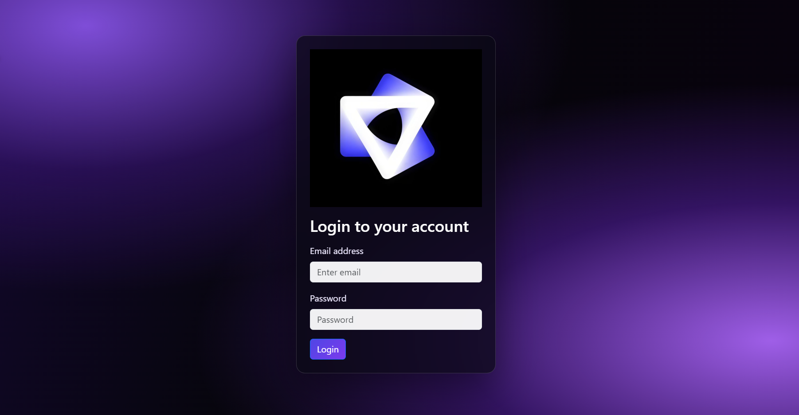

A device status dashboard built with React — log in to view the online/offline status of your Apple devices. Built as part of the Sigma School front-end development course.

## Features

- 🔐 **Login flow** — log in with demo credentials, protected by a route guard
- 🛡️ **Route guard** — visiting `/dashboard` without logging in redirects you to `/login`
- 📱 **Device cards** — each device shows its image, location, last seen time and status badge
- 🟢🔴 **Status filtering** — filter devices by All / Online / Offline
- 💾 **Persistent login** — login state is saved in the browser, so a page refresh keeps you logged in
- ✨ **Responsive design** — polished dark gradient UI that adapts to mobile and desktop

## Tech Stack

- **React 19** — components, props, state, Context
- **Vite** — build tool and dev server
- **React Router 7** — pages and route protection
- **Bootstrap 5 + react-bootstrap** — layout and UI components
- **usehooks-ts** — `useLocalStorage` for persistent login state
